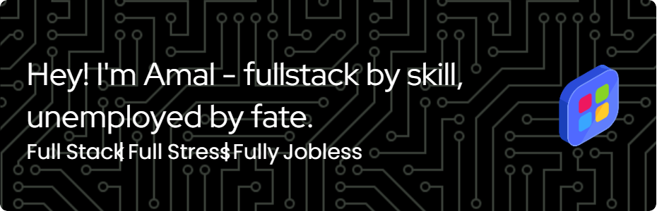

<h3 align="center"> Skills </h3>

  
  
  
  
  
  
  
  
  
  
  
  
  
  
  
  
  
  
  
  
  
  
  
  
  
  
  
  
  
  
  

<h3 align="center">Connect with me</h3>

  
  
  
  
  

  
  

 

    

